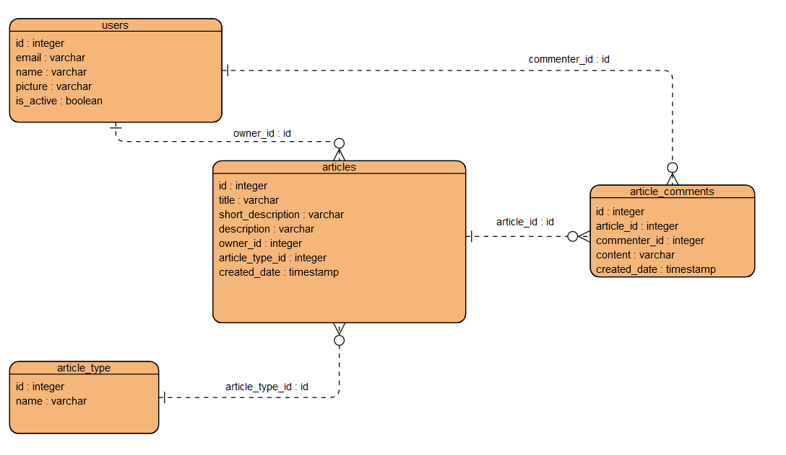

# Модель данных для блога

## User
Представляет собой пользователя блога.

- **id**: Уникальный идентификатор пользователя.
- **email**: Электронная почта пользователя (уникальная).
- **name**: Имя пользователя.
- **picture**: Ссылка на изображение профиля пользователя.
- **is_active**: Флаг, указывающий, активен ли пользователь.
- **articles**: Список статей, опубликованных пользователем.

## Article
Представляет собой статью в блоге.

- **id**: Уникальный идентификатор статьи.
- **title**: Заголовок статьи.
- **short_description**: Краткое описание статьи.
- **description**: Полное описание статьи.
- **owner_id**: Идентификатор владельца статьи (ссылка на пользователя).
- **owner**: Владелец статьи (связь с пользователем).
- **article_type_id**: Идентификатор типа статьи (ссылка на тип статьи).
- **created_date**: Дата создания статьи.
- **comments**: Список комментариев к статье.

## ArticleType
Представляет собой тип статьи.

- **id**: Уникальный идентификатор типа статьи.
- **name**: Название типа статьи.

## ArticleComment
Представляет собой комментарий к статье.

- **id**: Уникальный идентификатор комментария.
- **article_id**: Идентификатор статьи, к которой относится комментарий (ссылка на статью).
- **article**: Статья, к которой относится комментарий (связь с статьей).
- **commenter_id**: Идентификатор пользователя, оставившего комментарий (ссылка на пользователя).
- **commenter**: Пользователь, оставивший комментарий (связь с пользователем).
- **content**: Текст комментария.
- **created_date**: Дата создания комментария.